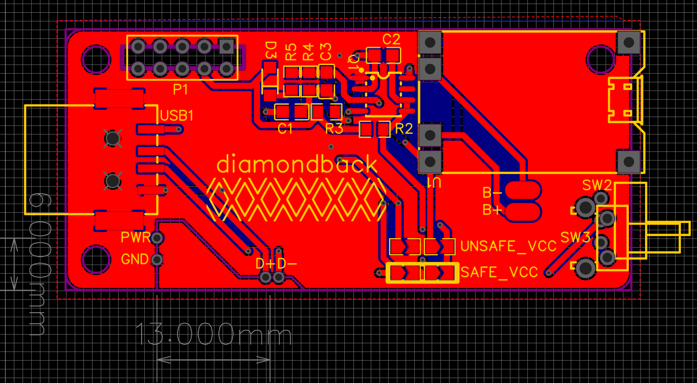
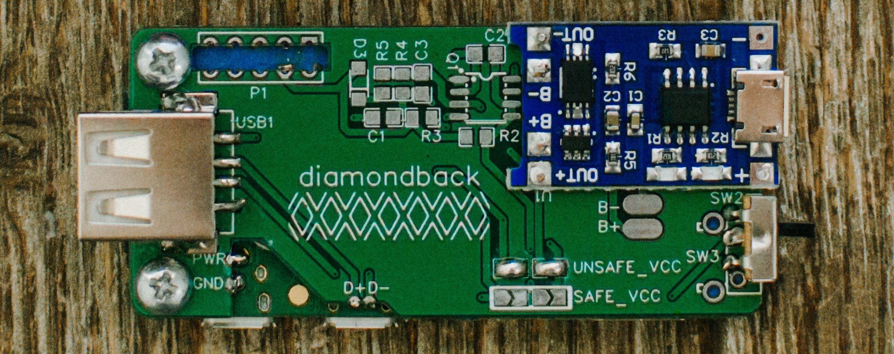

# PCB

The PCB is designed to be soldered directly to the back of a Raspberry Pi Zero (w/2/2w) without any standoff (Surface Mount Style). It is designed in [EasyEDA](https://easyeda.com/)

### BOM

It has minimal BOM (see [this](BOM_PCB_hotdrop_2021-08-02.csv) csv for complete list and details):

- Toggle Switch
- USB Type A Female
- TP4056 Charge Controller

All other components are fore the optional safe shut down circuitry.

### Charge Controller

The charge controller is a generic and vastly available [TP4056](https://www.google.com/search?q=tp4056&sxsrf=AOaemvKA5Golv8ZORMAJuqQzeIne3pn4XQ:1642352115592&source=lnms&tbm=isch&sa=X&ved=2ahUKEwiP_Mez3rb1AhValmoFHcQ2ApsQ_AUoAnoECAEQBA&biw=1620&bih=969&dpr=2) battery charge board soldered surface-mount style onto the PCB.

### Safe Shut Down

The initial board was designed to house a circuit that was intended to automatically cut power when it detected the pi was off. And then switch the power back on when the button was pressed. It is inspired from [Macrofab](https://macrofab.com/blog/power-control-product-starting-stopping-electrons/) and replicated from [Mosaic Industries Controller](http://www.mosaic-industries.com/embedded-systems/microcontroller-projects/raspberry-pi/on-off-power-controller)

Unfortunately I was unable to get this working. I really want to get this feature working as I want to be able to use it on other projects like a Gameboy Zero. I got the circuit to simulate in [falstad](https://www.falstad.com/circuit/) and worked! (see the falstad [save file](circuit-20210802-1813.circuitjs.txt)) but I just wasn't able to get it working on the board.

Luckily I was smart and planned for its failure. There are 4 jumpers to enable/disable the safe power toggle. Bridging the `SAFE_VCC` jumpers enables it and utilizes a push button. Bridging only the `UNSAFE_VCC` utilized a toggle switch to cut the power. (_DO NOT BRIDGE ANY OTHER COMBINATION_).
